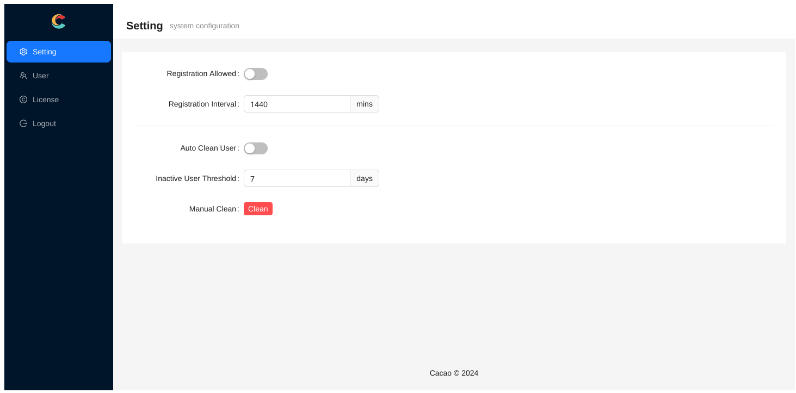
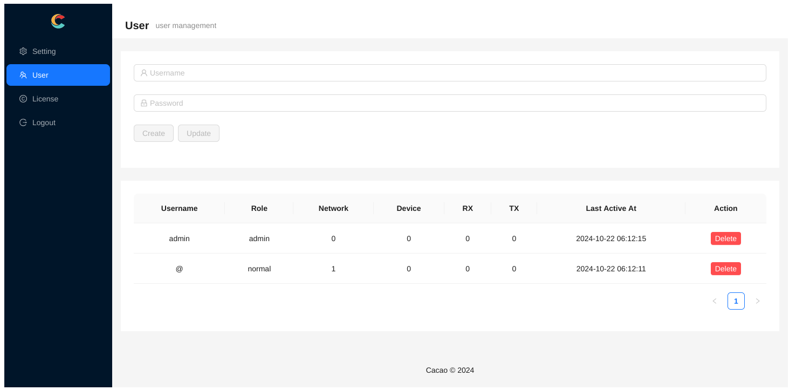

# 部署 Web 服务端

## 前置条件

知道如何部署 Web 服务,并能够申请证书后对外提供 HTTPS 服务.

否则使用明文传输将导致数据泄漏,存在安全隐患.此时建议使用社区服务器构建私有网络.

## 一键部署服务端

```bash
docker run --name=cacao --detach --volume /var/lib/cacao:/var/lib/cacao --publish 8080:80 docker.io/lanthora/cacao:latest
```

## 使用

假设你的域名为 `example.com`, 此时通过 `https://example.com` 应该能够正常访问服务.如果不是 `https` 请回到最开始解决前置条件.

服务器启动后的第一个注册用户默认被设置为管理员.管理员无法创建网络,且无权查看其他用户的网络.

管理员配置页面,能够配置是否允许注册,以及允许注册时的注册间隔(避免脚本小子刷注册用户).同时可以配置自动清理不活跃用户.



### 单网络模式

在不允许注册时,管理员可以手动添加用户.其中名为 @ 的用户是一个特殊用户,这个用户只能创建一个名为 @ 的网络.用户名和网络名的作用在后面说明.先创建这个用户.



退出管理员,并以 @ 用户登录.此时已经默认添加了 @ 网络.默认网络生成了随机密码 `ZrhaUcz1`


此时连接这个网络的客户端仅需要修改以下配置:

```cfg
websocket = "wss://example.com"
password = "ZrhaUcz1"
```

除非你知道自己在做什么,否则请不要修改任何其他配置项.

### 多用户多网络模式

如果只是创建一个网络,单网络模式已经足够了.如果要允许多个用户使用,且每个用户可以创建多个网络.则可以使用多用户多网络模式.

假设由管理员创建或自行注册的普通用户名为 `${username}`, 这个用户拥有的一个网络名是 `${netname}`,那么客户端对应的配置仅需要修改为:

```cfg
websocket = "wss://example.com/${username}/${netname}"
```

当用户名或者网络名为 @ 时,在客户端的配置中需要留空.当用户名和网络名都为空时,就是所谓的单网络模式
