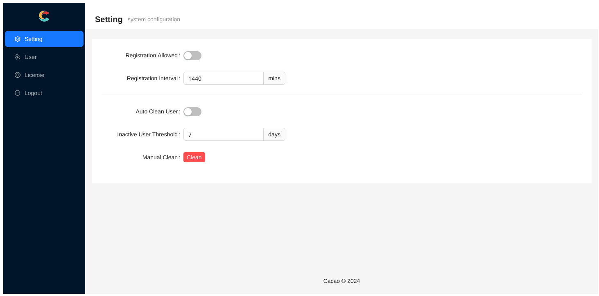
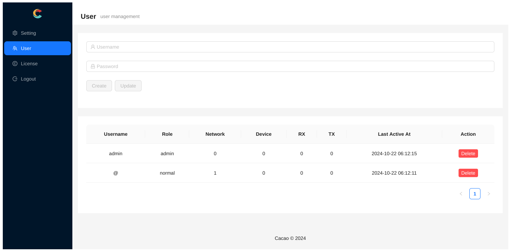
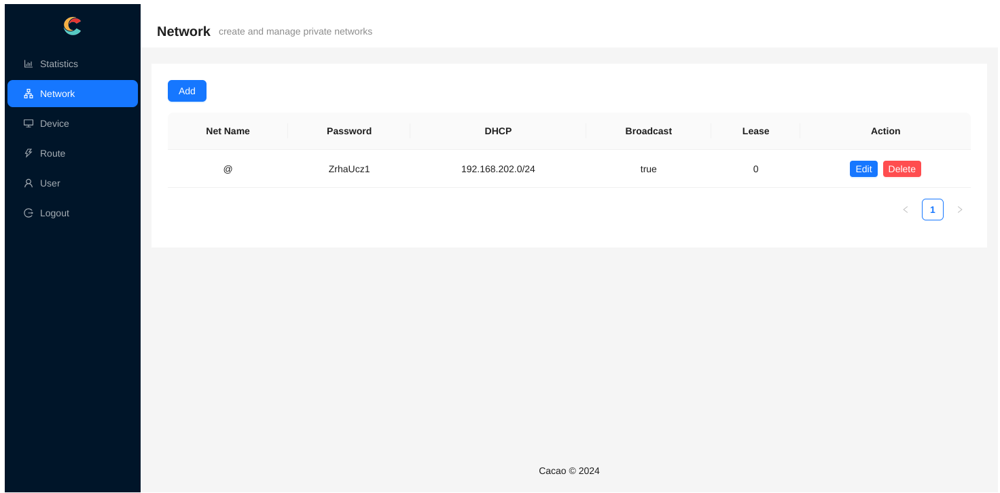

# Deploy Web Server

**[中文文档](deploy-web-server.zh-CN.md)**

## Prerequisites

Know how to deploy web services and obtain certificates to provide HTTPS services externally.

Otherwise, using plaintext transmission will lead to data leakage and security risks. In this case, it is recommended to use the community server to build a private network.

## One-Click Server Deployment

```bash
docker run --name=cacao --detach --volume /var/lib/cacao:/var/lib/cacao --publish 8080:80 docker.io/lanthora/cacao:latest
```

## Usage

Assume your domain is `example.com`. At this point, you should be able to access the service normally via `https://example.com`. If it's not `https`, please go back to the beginning and solve the prerequisites.

The first registered user after the server starts is set as administrator by default. Administrators cannot create networks and have no permission to view other users' networks.

The administrator configuration page allows you to configure whether registration is allowed, and the registration interval when registration is allowed (to avoid script kiddies flooding registration users). You can also configure automatic cleanup of inactive users.



### Single Network Mode

When registration is not allowed, administrators can manually add users. Among them, the user named `@` is a special user who can only create a network named `@`. The role of username and network name will be explained later. First, create this user.



Log out as administrator and log in as the `@` user. At this point, the `@` network has been added by default. The default network generated a random password `ZrhaUcz1`.



At this point, clients connecting to this network only need to modify the following configuration:

```cfg
websocket = "wss://example.com"
password = "ZrhaUcz1"
```

Unless you know what you're doing, please do not modify any other configuration items.

### Multi-User Multi-Network Mode

If you just want to create one network, single network mode is sufficient. If you want to allow multiple users to use it, and each user can create multiple networks, you can use multi-user multi-network mode.

Assume a normal user created by the administrator or self-registered is named `${username}`, and this user has a network named `${netname}`, then the corresponding client configuration only needs to be modified to:

```cfg
websocket = "wss://example.com/${username}/${netname}"
```

When the username or network name is `@`, it needs to be left blank in the client configuration. When both username and network name are blank, it is the so-called single network mode.
