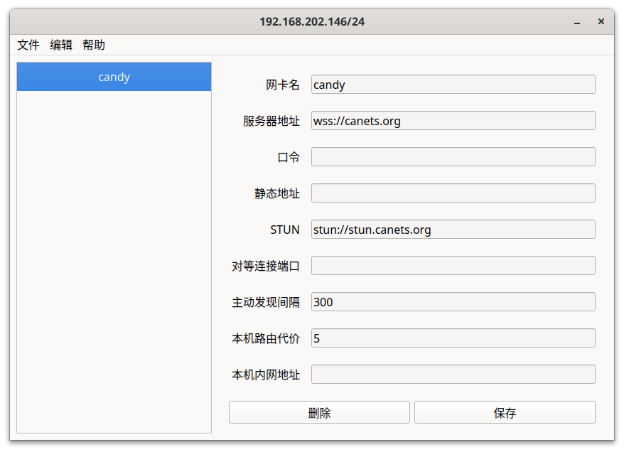

# 安装 Windows 客户端

## 图形用户界面

对于 Windows 10 及以上的用户,请使用[图形界面版本](https://github.com/lanthora/cake/releases/latest).此版本支持同时配置多个网络.

在没有任何配置时,点击 "文件" => "新建" 将填充默认配置,点击 "保存" 后配置生效,客户端此时才开始连接服务端. 

图形界面的配置与[默认配置](https://raw.githubusercontent.com/lanthora/candy/refs/heads/master/candy.cfg)对应.

日志保存在 `C:/ProgramData/Cake/logs`, 反馈 Windows 相关问题请带着日志和配置截图.



## 命令行

使用命令行版本请自行解决遇到的任何问题,我们不对 Windows 命令行提供任何技术支持.

Windows 7 用户只能使用[命令行版本](https://github.com/lanthora/candy/releases/latest)

### 添加win7及以下系统的cli运行批处理

参考使用方法，在candy目录下新建`run.bat`并使用文本编辑器输入以下内容

```
@echo off
:1
path = %path%;.\..\bin;
candy.exe -c candy.cfg --debug
goto 1
pause
```

保存后运行`run.bat`即可，只要bat文件不退出，可对candy进行保活防止意外中断。
