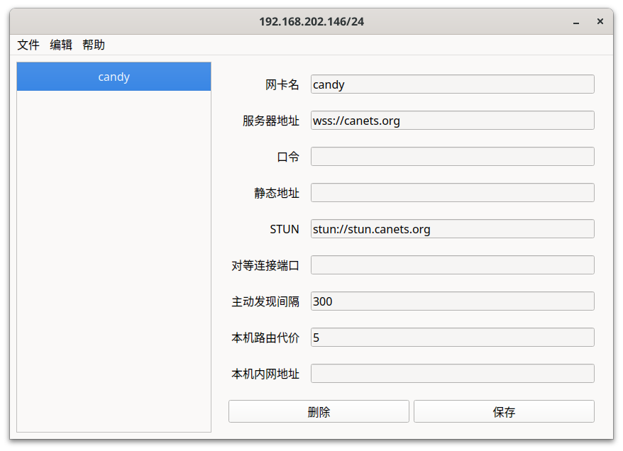

# Install Windows Client

**[中文文档](install-client-for-windows.zh-CN.md)**

## Graphical User Interface

For Windows 10 and above users, please use the [graphical interface version](https://github.com/lanthora/cake/releases/latest). This version supports configuring multiple networks simultaneously.

When there is no configuration, click "File" => "New" to populate the default configuration. After clicking "Save", the configuration takes effect and the client starts connecting to the server.

The GUI configuration corresponds to the [default configuration](https://raw.githubusercontent.com/lanthora/candy/refs/heads/master/candy.cfg).

Logs are saved in `C:/ProgramData/Cake/logs`. When reporting Windows-related issues, please include logs and configuration screenshots.

## Command Line

If you use the command-line version, please solve any problems you encounter on your own. We do not provide any technical support for the Windows command line.

Windows 7 users can only use the [command-line version](https://github.com/lanthora/candy/releases/latest).
