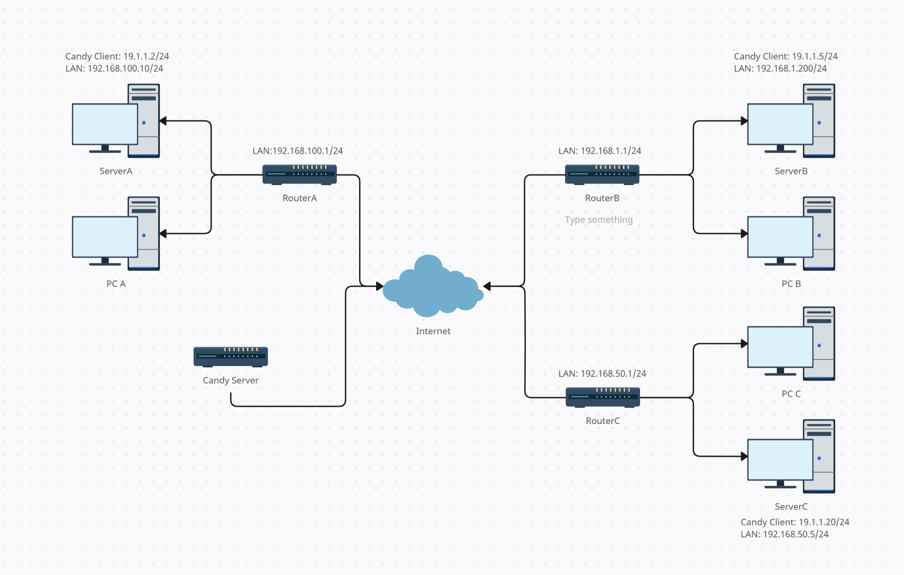

# 多局域网互联

# 需求

有3地不同网段的局域网分别是
A: 192.168.100.0/24
B: 192.168.1.0/24
C: 192.168.50.0/24

目的在多运营商多地下实现局域网互通



# 实现&&效果

- 仅需局域网任何设备 Linux 运行 Candy
- 简易主路由配置，对系统无要求
- 局域网任意设备直接访问其他任意局域网设备（不使用 Candy 网段）

```bash
root@debian[~]# traceroute 192.168.5.145
traceroute to 192.168.5.145 (192.168.5.145), 30 hops max, 60 byte packets
 1  192.168.100.1 (192.168.100.1)  0.142 ms  0.097 ms  0.063 ms
 2  192.168.100.10 (192.168.100.10)  0.210 ms  0.237 ms  0.210 ms
 3  19.1.1.20 (19.1.1.20)  154.661 ms  154.675 ms  154.648 ms
 4  192.168.5.145 (192.168.5.145)  154.651 ms  290.942 ms  291.014 ms
```

# 思路

在局域网任意 Linux 设备运行 Candy 客户端，使用在 Linux 本地对异地局域网网段设置静态路由将异地网段的网关指向 Candy 虚拟网中**异地主机的IP**，实现本地 Linux 主机对异地局域网网段的访问。再对本地主路由配置静态路由将异地网段的网关指向**运行 Candy 的本地 Linux 主机 IP** 即可实现本地局域网所有设备对异地局域网所有设备的访问。同时对多地主机进行相同设置即可实现多地局域网互联。

# 客户端环境&&配置

## 局域网 A

### 主路由 A

- 环境

LAN IP：192.168.100.1/24

- 配置

设置2条静态路由

Dst Address：192.168.1.0/24  Gateway：192.168.100.10

Dst Address：192.168.50.0/24 Gateway：192.168.100.10

### Candy 客户端 ServerA

- 环境

LAN IP：192.168.100.10/24 (网卡名：eth1)
Candy IP：19.1.1.2/24

- 配置

```bash
#ServerA_candy.cfg
mode = "client";
websocket = "wss://canets.org/demo";
name = "server1";
stun = "stun://stun.canets.org";
discovery = 300;
route = 5;
tun = "19.1.1.2/24"
restart = 3
```

iptables 命令：

```bash
iptables -t nat -A POSTROUTING -o candy-server1 -j MASQUERADE
iptables -A FORWARD -i eth1 -o candy-server1 -j ACCEPT
iptables -A FORWARD -i candy-server1 -o eth1 -m state --state RELATED,ESTABLISHED -j ACCEPT
```

静态路由配置：

```bash
ip route add 192.168.1.0/24 via 19.1.1.5 dev candy-server1
ip route add 192.168.50.0/24 via 19.1.1.20 dev candy-server1
```

## 局域网 B

### 主路由 B

- 环境

LAN IP：192.168.1.1/24

- 配置

设置2条静态路由

Dst Address：192.168.100.0/24  Gateway：192.168.1.200

Dst Address：192.168.50.0/24 Gateway：192.168.1.200

### Candy 客户端 ServerB

- 环境

LAN IP：192.168.1.200/24  (网卡名：eth2)
Candy IP：19.1.1.5/24

- 配置

```bash
#ServerB_candy.cfg
mode = "client";
websocket = "wss://canets.org/demo";
name = "server2";
stun = "stun://stun.canets.org";
discovery = 300;
route = 5;
tun = "19.1.1.5/24"
restart = 3
```

iptables 命令：

```bash
iptables -t nat -A POSTROUTING -o candy-server2 -j MASQUERADE
iptables -A FORWARD -i eth2 -o candy-server2 -j ACCEPT
iptables -A FORWARD -i candy-server2 -o eth2 -m state --state RELATED,ESTABLISHED -j ACCEPT
```

静态路由配置：

```bash
ip route add 192.168.100.0/24 via 19.1.1.2 dev candy-server2
ip route add 192.168.50.0/24 via 19.1.1.20 dev candy-server2
```

## 局域网 C

### 主路由 C

- 环境

LAN IP：192.168.50.1/24

- 配置

设置2条静态路由

Dst Address：192.168.100.0/24  Gateway：192.168.50.5

Dst Address：192.168.1.0/24 Gateway：192.168.50.5

### Candy 客户端 ServerC

- 环境

LAN IP：192.168.50.5/24  (网卡名：eth3)
Candy IP：19.1.1.20/24

- 配置

```bash
#ServerC_candy.cfg
mode = "client";
websocket = "wss://canets.org/demo";
name = "server3";
stun = "stun://stun.canets.org";
discovery = 300;
route = 5;
tun = "19.1.1.20/24"
restart = 3
```

iptables 命令：

```bash
iptables -t nat -A POSTROUTING -o candy-server3 -j MASQUERADE
iptables -A FORWARD -i eth3 -o candy-server3 -j ACCEPT
iptables -A FORWARD -i candy-server3 -o eth3 -m state --state RELATED,ESTABLISHED -j ACCEPT
```

静态路由配置：

```bash
ip route add 192.168.100.0/24 via 19.1.1.2 dev candy-server3
ip route add 192.168.1.0/24 via 19.1.1.5 dev candy-server3
```

---

另外需要注意的是上面的 Linux 都要开启 IPv4 转发

```bash
echo 'net.ipv4.ip_forward = 1' | sudo tee -a /etc/sysctl.conf
sudo sysctl -p /etc/sysctl.conf
```
