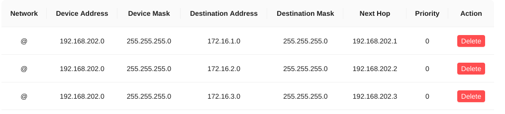

# 多局域网组网

## 需求

在多地有多个局域网时,希望能够让本局域网内的设备通过其他局域网的地址直接访问对方的设备,并且无需在所有设备上部署 Candy 客户端.

## 示例

首先你需要:

- 有一个独立的网络.可以自建服务端或者使用社区服务器
- 在网关 (Gateway) 上部署 Candy 并成功加入自己创建的网络

以 LAN A 为例解释表格含义.

- 局域网 (Network) 地址为 `172.16.1.0/24`, 这个地址不能与 B,C 冲突
- 网关 (Gateway) 可以是路由器,也可以是局域网中任意一台 Linux 系统,但需要能够部署 Candy 客户端,假设它在局域网中的地址是 `172.16.1.1`. 通过给局域网中的设备配置路由,确保流量能够进入网关
- Candy 客户端部署在网关上,它在虚拟网络中的地址是 `192.168.202.1`

| LAN     | A             | B             | C             |
| :------ | :------------ | :------------ | :------------ |
| Network | 172.16.1.0/24 | 172.16.2.0/24 | 172.16.3.0/24 |
| Gateway | 172.16.1.1    | 172.16.2.1    | 172.16.3.1    |
| Candy   | 192.168.202.1 | 192.168.202.2 | 192.168.202.3 |

当 `172.16.1.0/24` 的设备访问 `172.16.2.0/24` 的设备时,希望流量可以通过以下方式送达:

```txt
172.16.1.0/24 <=> 172.16.1.1 <=> 192.168.202.1 <=> 192.168.202.2 <=> 172.16.2.1 <=> 172.16.2.0/24
```

### 流量转发到网关 (172.16.1.0/24 => 172.16.1.1)

如果网关是路由器,不需要任何操作,流量就应该能够进入网关.否则需要在非网关设备上配置流量转发到网关的路由.

给 172.16.1.0/24 的设备配置路由:

- dst: 172.16.2.0/24; gw: 172.16.1.1
- dst: 172.16.3.0/24; gw: 172.16.1.1

需要用同样的方式给另外两个局域网做配置.

### 允许网关转发流量 (172.16.1.1 <=> 192.168.202.1)

#### Linux

如果你的网关是路由器,应该能够轻易的配置出允许转发.否则需要手动添加转发相关的配置.

开启内核流量转发功能

```bash
sysctl -w net.ipv4.ip_forward=1
```

开启动态伪装并接受转发报文.

```bash
iptables -t nat -A POSTROUTING -j MASQUERADE
iptables -A FORWARD -j ACCEPT
```

#### Windows

查看的网卡名,应该与配置文件中写的名称相同,对于 GUI 版本客户端的默认配置网卡名应该为 `candy`

```ps
Get-NetAdapter
```

允许转发,注意要把网卡名替换成上一步查出来的网卡名

```ps
Set-NetIPInterface -ifAlias 'candy' -Forwarding Enabled
```

#### macOS

应该不会有人拿 macOS 做网关吧, Windows 应该都没有多少人,有需要再补充这部分文档

### 创建虚拟链路 (172.16.1.0/24 <=> 172.16.2.0/24)

所有 Candy 客户端 `192.168.202.0/24` 收到发往 `172.16.1.0/24` 的 IP 报文时,将其转发到 `192.168.202.1`;
所有 Candy 客户端 `192.168.202.0/24` 收到发往 `172.16.2.0/24` 的 IP 报文时,将其转发到 `192.168.202.2`;
所有 Candy 客户端 `192.168.202.0/24` 收到发往 `172.16.3.0/24` 的 IP 报文时,将其转发到 `192.168.202.3`;

策略会发下给属于 `192.168.202.0/24` 网络的客户端,上面的配置下发给了虚拟网络中的所有设备,能够满足大部分用户场景.

此外支持更细粒度的控制供用户选择,例如 `192.168.202.1/32` 就表示仅把路由策略下发给 `192.168.202.1` 这台设备.

#### Cacao 配置

如果你在使用 Cacao 服务端(例如社区服务端),配置如下.



#### Candy 配置

如果你在使用命令行版本的 Candy 服务端,等效配置如下. 

```ini
sdwan = "192.168.202.0/24,172.16.1.0/24,192.168.202.1;192.168.202.0/24,172.16.2.0/24,192.168.202.2;192.168.202.0/24,172.16.3.0/24,192.168.202.3;"
```

### 测试

此时局域网设备之间应当可以相互 ping 通.

## 常见问题

### 能 ping 通网关,但 ping 不通网关下的目标设备

- 检查 iptables 配置的动态伪装是否生效.如果生效,抓包可以看到发往目标设备的源地址已经改成了网关地址
- 检查目标设备防火墙.例如 Windows 系统防火墙默认禁止 ping, 此时直接尝试访问 Windows 提供出的服务,例如远程桌面, SSH, Web 服务等

### 能 ping 通目标设备,但不能访问服务

- 检查 iptables 配置的动态伪装是否生效.动态伪装不生效的情况下,某种路由配置规则也可以实现 ping 通目标设备,但是防火墙会拦截对应报文.

### 关于源进源出

通过合理的路由配置和对防火墙策略的调整,在不使用动态伪装的情况下,可以做到在目标设备看到请求的真实源地址.想要达成这个效果需要有足够的计算机网络知识储备,请自行探索.

