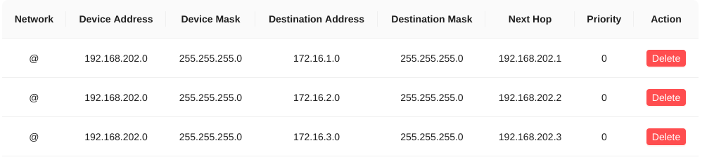

# Multi-LAN Networking

**[中文文档](software-defined-wide-area-network.zh-CN.md)**

## Requirements

When there are multiple local area networks in multiple locations, we want devices in one LAN to directly access devices in other LANs through their addresses, without deploying Candy clients on all devices.

## Example

First, you need:

- An independent network (you can build your own server or use the community server)
- Deploy Candy on the Gateway and successfully join the network you created

Taking LAN A as an example to explain the table meaning:

- The LAN (Network) address is `172.16.1.0/24`, which cannot conflict with B and C
- The Gateway can be a router or any Linux system in the LAN, but it needs to be able to deploy the Candy client. Assume its address in the LAN is `172.16.1.1`. By configuring routes for devices in the LAN, ensure traffic can enter the gateway
- The Candy client is deployed on the gateway, and its address in the virtual network is `192.168.202.1`

| LAN     | A             | B             | C             |
| :------ | :------------ | :------------ | :------------ |
| Network | 172.16.1.0/24 | 172.16.2.0/24 | 172.16.3.0/24 |
| Gateway | 172.16.1.1    | 172.16.2.1    | 172.16.3.1    |
| Candy   | 192.168.202.1 | 192.168.202.2 | 192.168.202.3 |

When devices in `172.16.1.0/24` access devices in `172.16.2.0/24`, we want traffic to be delivered in the following way:

```txt
172.16.1.0/24 <=> 172.16.1.1 <=> 192.168.202.1 <=> 192.168.202.2 <=> 172.16.2.1 <=> 172.16.2.0/24
```

### Forward Traffic to Gateway (172.16.1.0/24 => 172.16.1.1)

If the gateway is a router, no operation is needed, and traffic should be able to enter the gateway. Otherwise, you need to configure routes on non-gateway devices to forward traffic to the gateway.

Configure routes for devices in 172.16.1.0/24:

- dst: 172.16.2.0/24; gw: 172.16.1.1
- dst: 172.16.3.0/24; gw: 172.16.1.1

You need to configure the other two LANs in the same way.

### Allow Gateway to Forward Traffic (172.16.1.1 <=> 192.168.202.1)

#### Linux

If your gateway is a router, you should be able to easily configure it to allow forwarding. Otherwise, you need to manually add forwarding-related configurations.

Enable kernel traffic forwarding:

```bash
sysctl -w net.ipv4.ip_forward=1
```

Enable dynamic masquerading and accept forwarded packets:

```bash
iptables -t nat -A POSTROUTING -j MASQUERADE
iptables -A FORWARD -j ACCEPT
```

#### Windows

Check the network adapter name. It should be the same as written in the configuration file. For the GUI version client, the default configuration network adapter name should be `candy`.

```ps
Get-NetAdapter
```

Allow forwarding. Note that you need to replace the network adapter name with the one found in the previous step:

```ps
Set-NetIPInterface -ifAlias 'candy' -Forwarding Enabled
```

#### macOS

Surely no one would use macOS as a gateway, right? There aren't many Windows users either. Documentation will be added if there's a need.

### Create Virtual Link (172.16.1.0/24 <=> 172.16.2.0/24)

All Candy clients `192.168.202.0/24` receiving IP packets destined for `172.16.1.0/24` will forward them to `192.168.202.1`.

All Candy clients `192.168.202.0/24` receiving IP packets destined for `172.16.2.0/24` will forward them to `192.168.202.2`.

All Candy clients `192.168.202.0/24` receiving IP packets destined for `172.16.3.0/24` will forward them to `192.168.202.3`.

The policy will be distributed to clients belonging to the `192.168.202.0/24` network. The above configuration is distributed to all devices in the virtual network, which can satisfy most user scenarios.

Additionally, more fine-grained control is supported for users to choose from. For example, `192.168.202.1/32` means only distributing routing policies to the device `192.168.202.1`.

#### Cacao Configuration

If you are using the Cacao server (for example, the community server), configure as follows:



#### Candy Configuration

If you are using the command-line version of the Candy server, the equivalent configuration is as follows:

```ini
sdwan = "192.168.202.0/24,172.16.1.0/24,192.168.202.1;192.168.202.0/24,172.16.2.0/24,192.168.202.2;192.168.202.0/24,172.16.3.0/24,192.168.202.3;"
```

### Test

At this point, devices in the LAN should be able to ping each other.

## FAQ

### Can ping gateway, but cannot ping target device behind gateway

- Check whether the dynamic masquerading configured by iptables is effective. If effective, packet capture can show that the source address sent to the target device has been changed to the gateway address
- Check the target device firewall. For example, Windows system firewall prohibits ping by default. In this case, try to directly access services provided by Windows, such as Remote Desktop, SSH, Web services, etc.

### Can ping target device, but cannot access service

- Check whether the dynamic masquerading configured by iptables is effective. When dynamic masquerading is not effective, certain routing configuration rules can also achieve ping to the target device, but the firewall will intercept corresponding packets.

### About Source-Based Routing

Through reasonable routing configuration and adjustment of firewall policies, without using dynamic masquerading, it is possible to see the real source address of the request on the target device. To achieve this effect, you need sufficient computer network knowledge. Please explore on your own.
