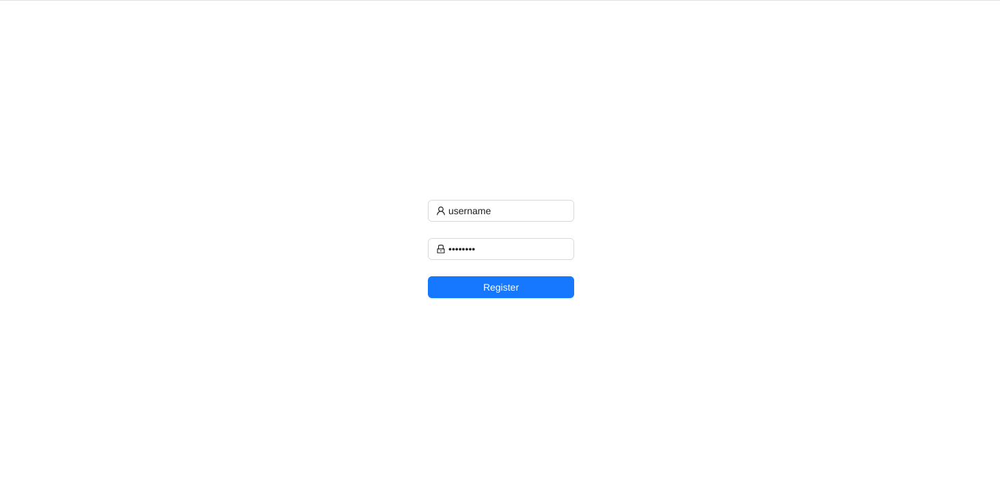
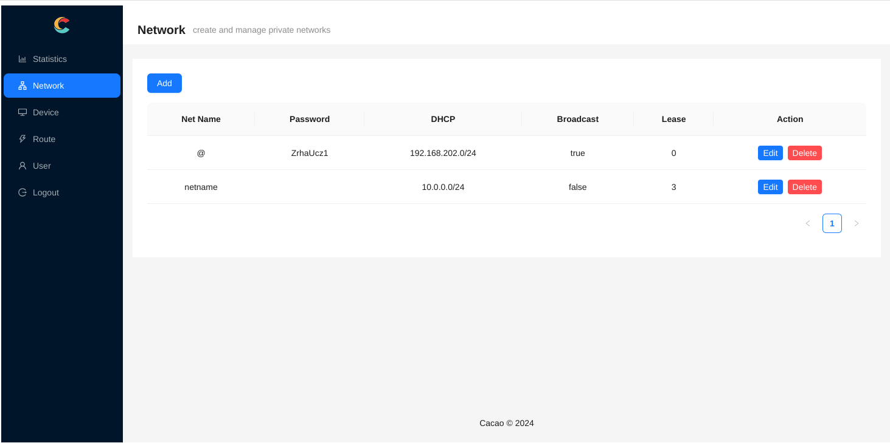

# Use Community Server

**[中文文档](use-the-community-server.zh-CN.md)**

The community server supports user-level isolation and supports one user creating multiple networks.

__The server will periodically clean up inactive users. Please ensure that at least one device has connected to the server in the short term, or manually log in to the server management page.__

## Register

Register on the community server [register page](https://canets.org/register). In the example, the username is `username`.



## Use Default Network

View the network and notice that there is already a default network named `@` with password `ZrhaUcz1`.


Clients connecting to this network only need to modify the following configuration. For the location of the configuration file, please refer to the relevant documentation for client installation:

```cfg
websocket = "wss://canets.org/username"
password = "ZrhaUcz1"
```

## Multiple Networks

Click `Add` in the upper left corner to create multiple networks, for example:



This new network has:
- Network name `netname`, which will be reflected in the `websocket` parameter
- Empty password
- Network range `10.0.0.0/24`
- No broadcast allowed
- Lease term of 3 days, meaning inactive clients will be automatically removed from the network after more than 3 days. Configuration of 0 means no automatic removal.

The client configuration should be:

```cfg
websocket = "wss://canets.org/username/netname"
password = ""
```

To assign a static address `10.0.0.1/24` to a specific client, just modify the configuration:

```cfg
tun = "10.0.0.1/24"
```
